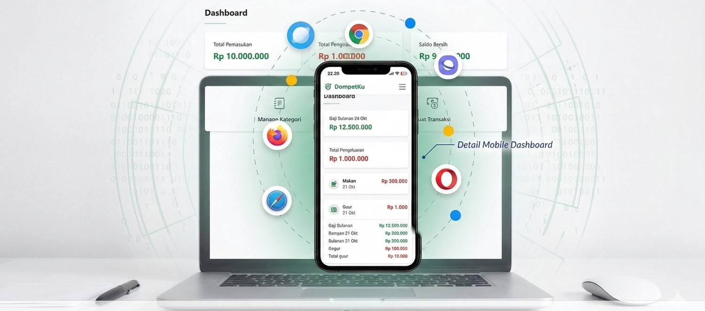

<p align="center">
  
</p>

<h1 align="center">DompetKu</h1>

<p align="center">
  Aplikasi pencatatan keuangan pribadi berbasis web yang sederhana, aman, dan mudah digunakan.
</p>

<p align="center">
  
  
  
  
  
</p>

---

## 📖 Tentang DompetKu

**DompetKu** adalah aplikasi pencatatan keuangan pribadi berbasis web yang dibangun menggunakan **Laravel 12**. Aplikasi ini membantu pengguna mencatat pemasukan dan pengeluaran, mengelola kategori transaksi, serta memantau kondisi keuangan melalui dashboard yang ringkas dan informatif.

Proyek ini dikembangkan sebagai bagian dari **Tugas Akhir (TA)** mata pelajaran Rekayasa Perangkat Lunak (RPL).

<p align="center">
  
</p>

---

## ✨ Fitur Utama

| Fitur                   | Deskripsi                                                              |
| ----------------------- | ---------------------------------------------------------------------- |
| 🔐 **Autentikasi**      | Register & Login dengan sistem autentikasi Laravel                     |
| 📊 **Dashboard**        | Ringkasan total pemasukan, pengeluaran, dan saldo bersih               |
| 🏷️ **Kategori**         | CRUD kategori dengan pilihan ikon & warna kustom                       |
| 💰 **Transaksi**        | Catat pemasukan & pengeluaran dengan kategori, tanggal, dan keterangan |
| 👤 **Profil**           | Upload foto profil, ubah nama, email, dan bio                          |
| 🎨 **Ikon Kustom**      | 44 pilihan ikon Bootstrap Icons untuk setiap kategori                  |
| 🟢🔴 **Warna Kategori** | Pilihan warna hijau (success) atau merah (danger) untuk kategori       |
| 🌐 **Landing Page**     | Halaman publik dengan hero, fitur, cara kerja, FAQ, dan CTA            |
| 📱 **Responsif**        | Tampilan optimal di desktop dan mobile                                 |

### 🚧 Coming Soon

-   **Riwayat** — Daftar lengkap seluruh transaksi dengan pencarian & filter
-   **Target Tabungan** — Buat tujuan tabungan dan pantau progres pencapaiannya

---

## 🛠️ Tech Stack

| Teknologi           | Versi  | Keterangan                    |
| ------------------- | ------ | ----------------------------- |
| **Laravel**         | 12.x   | PHP Framework                 |
| **PHP**             | 8.2+   | Server-side Language          |
| **SQLite**          | -      | Database                      |
| **Bootstrap**       | 5.3.3  | CSS Framework (CDN)           |
| **Bootstrap Icons** | 1.11.3 | Icon Library (CDN)            |
| **Blade**           | -      | Template Engine               |
| **Laravel Storage** | -      | Public disk untuk upload foto |

---

## 📁 Struktur Proyek

```
DompetKu/
├── app/
│   ├── Http/Controllers/
│   │   ├── AuthController.php          # Register, Login, Logout
│   │   ├── DashboardController.php     # Ringkasan keuangan
│   │   ├── CategoryController.php      # CRUD Kategori
│   │   ├── TransactionController.php   # CRUD Transaksi
│   │   └── ProfileController.php       # Profil pengguna
│   └── Models/
│       ├── User.php                    # Model pengguna
│       ├── Category.php                # Model kategori
│       └── Transaction.php             # Model transaksi
├── database/
│   ├── database.sqlite                 # SQLite database
│   └── migrations/                     # Migration files
├── resources/views/
│   ├── landing.blade.php               # Landing page (guest)
│   ├── dashboard.blade.php             # Dashboard (auth)
│   ├── layouts/app.blade.php           # Base layout
│   ├── includes/
│   │   ├── navbar.blade.php            # Navbar (auth)
│   │   └── footer.blade.php            # Footer
│   ├── Auth/
│   │   ├── login.blade.php             # Halaman login
│   │   └── register.blade.php          # Halaman register
│   ├── kategori/
│   │   ├── index.blade.php             # Daftar kategori
│   │   ├── create.blade.php            # Tambah kategori
│   │   └── edit.blade.php              # Edit kategori
│   ├── transaksi/
│   │   ├── index.blade.php             # Daftar transaksi
│   │   ├── create.blade.php            # Tambah transaksi
│   │   ├── edit.blade.php              # Edit transaksi
│   │   └── show.blade.php              # Detail transaksi
│   └── profile/
│       ├── index.blade.php             # Lihat profil
│       └── edit.blade.php              # Edit profil
├── public/
│   ├── logo.png                        # Logo aplikasi
│   └── heroimage.jpeg                  # Hero image landing page
└── routes/
    └── web.php                         # Definisi semua route
```

---

## 🗄️ Database Schema

### Users

| Kolom    | Tipe   | Keterangan                  |
| -------- | ------ | --------------------------- |
| id       | bigint | Primary key                 |
| nama     | string | Nama pengguna               |
| email    | string | Email (unique)              |
| password | string | Password (hashed)           |
| foto     | string | Path foto profil (nullable) |
| bio      | text   | Bio pengguna (nullable)     |

### Categories

| Kolom         | Tipe      | Keterangan                                  |
| ------------- | --------- | ------------------------------------------- |
| id            | bigint    | Primary key                                 |
| user_id       | foreignId | Relasi ke users                             |
| nama_kategori | string    | Nama kategori                               |
| ikon          | string    | Bootstrap Icon class (default: bi-tag-fill) |
| warna         | string    | Warna Bootstrap: success / danger           |

### Transactions

| Kolom       | Tipe      | Keterangan                  |
| ----------- | --------- | --------------------------- |
| id          | bigint    | Primary key                 |
| user_id     | foreignId | Relasi ke users             |
| category_id | foreignId | Relasi ke categories        |
| judul       | string    | Judul transaksi             |
| tipe        | enum      | pemasukan / pengeluaran     |
| jumlah      | integer   | Nominal transaksi           |
| tanggal     | date      | Tanggal transaksi           |
| keterangan  | text      | Catatan tambahan (nullable) |

---

## 🚀 Instalasi & Setup

### Prasyarat

-   PHP >= 8.2
-   Composer
-   SQLite

### Langkah Instalasi

```bash
# 1. Clone repository
git clone https://github.com/username/DompetKu.git
cd DompetKu

# 2. Install dependencies
composer install

# 3. Salin file environment
cp .env.example .env

# 4. Generate application key
php artisan key:generate

# 5. Buat file database SQLite
touch database/database.sqlite

# 6. Jalankan migration
php artisan migrate

# 7. Buat symbolic link untuk storage
php artisan storage:link

# 8. Jalankan server
php artisan serve
```

Buka browser dan akses `http://localhost:8000`

---

## 🔄 Alur Penggunaan

```
Landing Page → Register → Login → Dashboard
                                      │
                          ┌───────────┼───────────┐
                          ▼           ▼           ▼
                      Kategori    Transaksi    Profile
                      (CRUD)      (CRUD)       (Edit)
                          │
                          ▼
                       Logout → Login
```

1. **Landing Page** — Informasi aplikasi, pilih Register atau Login
2. **Register** — Buat akun dengan nama, email, password
3. **Login** — Masuk dengan email & password
4. **Dashboard** — Lihat total pemasukan, pengeluaran, dan saldo
5. **Kategori** — Buat kategori dengan ikon & warna pilihan
6. **Transaksi** — Catat pemasukan/pengeluaran
7. **Profile** — Update foto, nama, email, bio
8. **Logout** — Keluar dari sistem

---

## 📄 License

Proyek ini menggunakan lisensi [MIT](https://opensource.org/licenses/MIT).

---

<p align="center">
  <sub>Dibuat dengan ❤️ menggunakan Laravel — DompetKu © 2026</sub>
</p>
